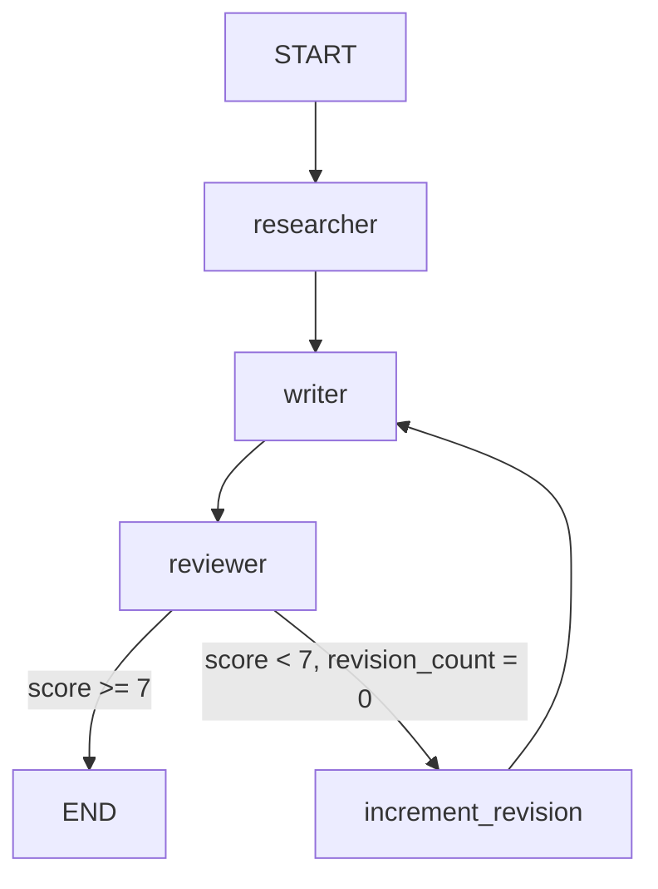

# Health Research Crew

A LangGraph multi-agent system that researches health supplement claims and produces evidence-based reports with automatic quality review.

## Graph Architecture

```
START
  |
  v
[Researcher] -- searches PubMed/clinical studies via Tavily
  |
  v
[Writer] -- structures findings into evidence-based report
  |
  v
[Reviewer] -- peer-reviews: accuracy, bias, evidence integrity
  |
  +-- score >= 7 ---------> END (final report)
  |
  +-- score < 7 ----------> [Writer] (1 revision max)
                                |
                             [Reviewer] ---------> END
```



## Quick Start

```bash
# 1. Install dependencies
pip install -e .

# 2. Set up API keys
cp .env.example .env
# Edit .env: add OPENAI_API_KEY and TAVILY_API_KEY

# 3. Run
python -m src.main "Is magnesium effective for improving sleep quality?"
```

## API Keys

| Key | Where to get | Free tier |
|-----|-------------|-----------|
| `GROQ_API_KEY` | console.groq.com | Free, no credit card required |

DuckDuckGo search requires no key.

## Architecture Decisions

### Why LangGraph over CrewAI?
LangGraph gives explicit control over the state machine - every node, edge, and transition is visible and testable. CrewAI abstracts this away. For production health applications where you need to audit why a specific decision was made, explicit graph traversal is preferable over framework magic.

### Conditional edge (revision loop)
The reviewer node returns a structured JSON with `quality_score` and `needs_revision`. The conditional edge routes back to the writer if score < 7, with a hard cap of 1 revision to prevent infinite loops. This mimics real peer-review workflows without unbounded cost.

### Two Tavily tools with different intent
- `search_health_topic` - broad research (5 results, looks for clinical trials and PubMed)
- `verify_claim` - targeted fact-check (3 results, looks for systematic reviews and meta-analyses)

Using different search intents produces better evidence coverage than a single generic search.

### TypedDict state contract
`AgentState` is a typed contract shared across all agents. Any agent can read any field; each agent updates only its own fields. This makes the data flow explicit and catches schema mismatches at development time.

### llama-3.3-70b-versatile via Groq
Free-tier model with strong instruction following. Groq's inference speed (hundreds of tokens/sec) makes multi-agent runs feel near-instant. The structured prompts with explicit JSON output format compensate for any differences vs. GPT-4o.

## Example Output

See [examples/output_example.md](examples/output_example.md) for a full run on "Is magnesium effective for improving sleep quality?"

## Project Structure

```
health-research-crew/
├── src/
│   ├── state.py          # AgentState TypedDict
│   ├── graph.py          # LangGraph graph definition + conditional routing
│   ├── main.py           # Entry point
│   ├── agents/
│   │   ├── researcher.py # Evidence gathering agent (uses Tavily tools)
│   │   ├── writer.py     # Report writing agent
│   │   └── reviewer.py   # Peer review agent (returns structured JSON)
│   └── tools/
│       └── search.py     # Tavily search tools
└── examples/
    └── output_example.md # Sample run output
```
